# DOSW_BITACORA

Bitacora del curso **DOSW** (Java 21/24 + Git) — Streams, Expresiones Lambda y Programacion Funcional.

Estructura: `src/main/dosw/semana_1/streams` (Streams basicos) y `src/main/dosw/semana_2/pokemon` (Bitacora Pokemon).

---

# SEMANA No 1 — DOSW Manejo de Streams

## Datos personales:
- Nombre y Apellido: Julian Morales
- Codigo de Estudiante: 1000091825
- Curso: DOSW

---

### Ejercicio 01 — Numeros Pares mayores a diez
**Operadores utilizados:** `filter()`

Dada una lista de numeros enteros, se debe obtener una nueva lista solo con los numeros pares mayores a 10. Entrada: [3,8,10,12,15,18,20] — Salida esperada: [12,18,20].

**Codigo implementado:**
```java
package dosw.semana_1.streams;

import java.util.List;
import java.util.stream.Collectors;

/**
 * Ejercicio 01 - Numeros pares mayores a diez
 * Operador: filter()
 */
public class Ejercicio1 {
    public static void main(String[] args) {
        List<Integer> numeros = List.of(3, 8, 10, 12, 15, 18, 20);

        List<Integer> pares = numeros.stream()
                .filter(n -> n % 2 == 0 && n > 10)
                .collect(Collectors.toList());

        System.out.println("Numeros pares mayores a 10: " + pares);
    }
}
```

**Captura de ejecucion:**

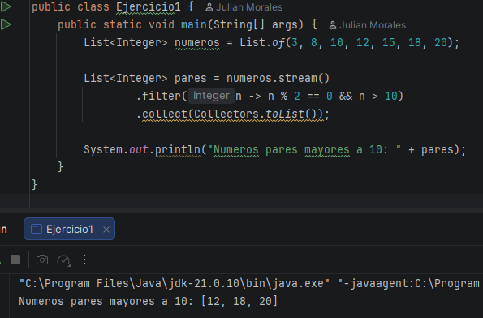

**Explicacion:**
Se usa `filter()` con una condicion compuesta (`n % 2 == 0 && n > 10`) para quedarnos unicamente con los numeros pares mayores a diez, y se recolecta el resultado en una lista con `collect(Collectors.toList())`.

---

### Ejercicio 02 — Cantidad de Palabras con mas de 4 caracteres
**Operadores utilizados:** `filter() - map() - sorted()`

Dada una lista de palabras, se filtran las que tengan mas de 4 caracteres, se convierten a mayusculas, se ordenan alfabeticamente y se obtiene la cantidad total resultante.

**Codigo implementado:**
```java
package dosw.semana_1.streams;

import java.util.List;
import java.util.stream.Collectors;

/**
 * Ejercicio 02 - Cantidad de palabras con mas de 4 caracteres
 * Operadores: filter() - map() - sorted()
 */
public class Ejercicio2 {
    public static void main(String[] args) {
        List<String> palabras = List.of("java", "stream", "api", "functional", "code", "git");

        List<String> resultado = palabras.stream()
                .filter(p -> p.length() > 4)
                .map(String::toUpperCase)
                .sorted()
                .collect(Collectors.toList());

        System.out.println("Palabras resultantes: " + resultado);
        System.out.println("Cantidad de palabras resultantes: " + resultado.size());
    }
}
```

**Captura de ejecucion:**

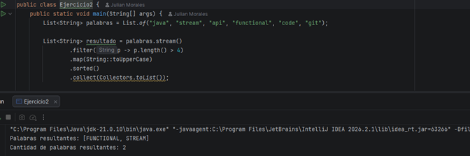

**Explicacion:**
El pipeline encadena `filter()` para descartar palabras cortas, `map()` con `String::toUpperCase` para transformarlas, y `sorted()` para el orden alfabetico. El tamano final se obtiene con `.size()` sobre la lista resultante.

---

### Ejercicio 03 — Obtener nombres de los Usuarios
**Operadores utilizados:** `filter() - map() - sorted()`

Dada una lista de usuarios (id, name, age, active), se filtran los usuarios activos, se obtienen sus nombres en mayuscula y se ordenan alfabeticamente. Se crea la clase `User` como apoyo.

**Codigo implementado:**
```java
package dosw.semana_1.streams;

import java.util.List;
import java.util.stream.Collectors;

/**
 * Ejercicio 03 - Obtener nombres de los usuarios activos
 * Operadores: filter() - map() - sorted()
 */
public class Ejercicio3 {
    public static void main(String[] args) {
        List<User> users = List.of(
                new User(1, "Camila", 22, true),
                new User(2, "Andres", 19, false),
                new User(3, "Brayan", 25, true),
                new User(4, "Diana", 30, false),
                new User(5, "Julian", 21, true)
        );

        List<String> sortedUsers = users.stream()
                .filter(User::isActive)
                .map(u -> u.getName().toUpperCase())
                .sorted()
                .collect(Collectors.toList());

        System.out.println("Usuarios activos ordenados: " + sortedUsers);
    }
}
```

**Captura de ejecucion:**

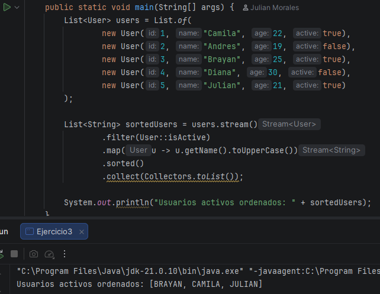

**Explicacion:**
`filter(User::isActive)` deja solo los usuarios activos; `map()` transforma cada uno a su nombre en mayuscula; `sorted()` ordena alfabeticamente el resultado final.

---

### Ejercicio 04 — Personas mayores de edad
**Operadores utilizados:** `filter() - map()`

Usando la misma clase `User`, se filtran las personas mayores de edad (edad >= 18) y se obtienen sus nombres.

**Codigo implementado:**
```java
package dosw.semana_1.streams;

import java.util.List;
import java.util.stream.Collectors;

/**
 * Ejercicio 04 - Personas mayores de edad
 * Operadores: filter() - map()
 */
public class Ejercicio4 {
    public static void main(String[] args) {
        List<User> users = List.of(
                new User(1, "Camila", 22, true),
                new User(2, "Andres", 17, false),
                new User(3, "Brayan", 25, true),
                new User(4, "Diana", 16, false),
                new User(5, "Julian", 21, true)
        );

        List<String> mayoresDeEdad = users.stream()
                .filter(u -> u.getAge() >= 18)
                .map(User::getName)
                .collect(Collectors.toList());

        System.out.println("Personas mayores de edad: " + mayoresDeEdad);
    }
}
```

**Captura de ejecucion:**

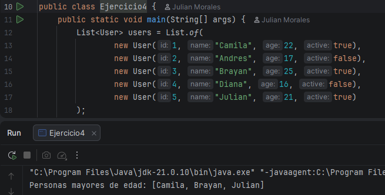

**Explicacion:**
Se aplica `filter()` sobre la edad para quedarnos con los mayores de edad, y luego `map(User::getName)` para proyectar unicamente el nombre de cada uno.

---

### Ejercicio 05 — Transacciones Bancarias
**Operadores utilizados:** `peek() - anyMatch()`

Dada una lista de transacciones bancarias (`Transaction`: id, amount, approved), se procesa la lista usando `peek()` para ver cada transaccion y `anyMatch()` para verificar si existe al menos una transaccion no aprobada, retornando si el lote es valido.

**Codigo implementado:**
```java
package dosw.semana_1.streams;

import java.util.List;

/**
 * Ejercicio 05 - Transacciones bancarias
 * Operadores: peek() - anyMatch()
 */
public class Ejercicio5 {
    public static void main(String[] args) {
        List<Transaction> transactions = List.of(
                new Transaction("T1", 150.0, true),
                new Transaction("T2", 300.0, true),
                new Transaction("T3", 75.5, false),
                new Transaction("T4", 500.0, true)
        );

        boolean existeNoAprobada = transactions.stream()
                .peek(System.out::println)
                .anyMatch(t -> !t.isApproved());

        boolean loteValido = !existeNoAprobada;

        System.out.println("Existe al menos una transaccion no aprobada: " + existeNoAprobada);
        System.out.println("El lote de transacciones es valido: " + loteValido);
    }
}
```

**Captura de ejecucion:**

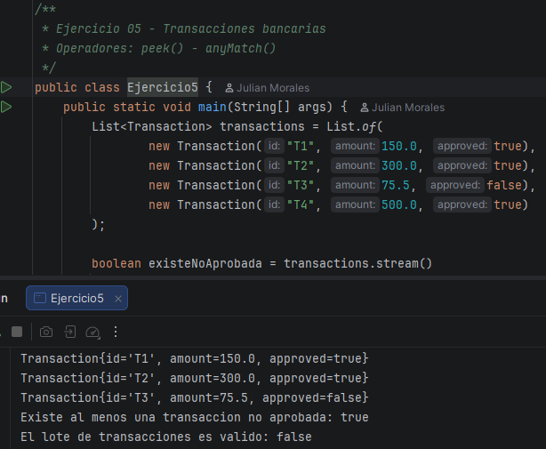

**Explicacion:**
`peek(System.out::println)` imprime cada transaccion a medida que se recorre el stream (unicamente con fines de trazabilidad, sin modificar el flujo); `anyMatch(t -> !t.isApproved())` determina si existe alguna transaccion no aprobada. El lote se considera valido cuando no existe ninguna transaccion no aprobada.

---

# SEMANA No 2 — Bitacora Pokemon

## Datos de Entrenador:
- Nombre y Apellido: Julian Morales
- Codigo de Estudiante: 1000091825
- Curso: DOSW

---

## Nivel 1 — Entrenador Novato
_Operaciones basicas con Streams_

### Ejercicio 01 — Pokemon Tipo Fuego
**Operadores utilizados:** `filter()`

Dada una lista de Pokemon con nombre y tipo, obtener unicamente aquellos cuyo tipo sea Fuego.

**Codigo implementado:**
```java
package dosw.semana_2.pokemon;

import java.util.List;
import java.util.stream.Collectors;

/**
 * Ejercicio 01 - Pokemon Tipo Fuego
 * Operador: filter()
 */
public class Ejercicio1 {

    record PokemonSimple(String nombre, String tipo) {}

    public static void main(String[] args) {
        List<PokemonSimple> pokedex = List.of(
                new PokemonSimple("Pikachu", "Electrico"),
                new PokemonSimple("Charmander", "Fuego"),
                new PokemonSimple("Squirtle", "Agua"),
                new PokemonSimple("Vulpix", "Fuego"),
                new PokemonSimple("Bulbasaur", "Planta"),
                new PokemonSimple("Flareon", "Fuego")
        );

        List<String> tipoFuego = pokedex.stream()
                .filter(p -> p.tipo().equals("Fuego"))
                .map(PokemonSimple::nombre)
                .collect(Collectors.toList());

        System.out.println("Pokemon tipo Fuego: " + tipoFuego);
    }
}
```

**Captura de ejecucion:**

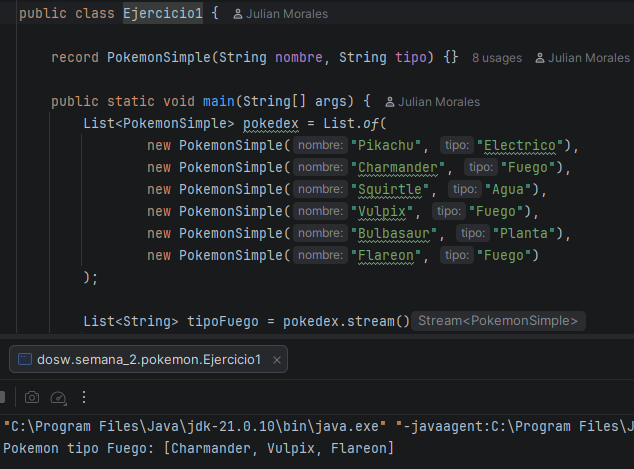

**Explicacion:**
Se filtra el stream con `filter()` comparando el tipo con "Fuego" y se proyecta el nombre con `map()`.

---

### Ejercicio 02 — Pokedex Gritona
**Operadores utilizados:** `map()`

Transformar todos los nombres de Pokemon a mayusculas.

**Codigo implementado:**
```java
package dosw.semana_2.pokemon;

import java.util.List;
import java.util.stream.Collectors;

/**
 * Ejercicio 02 - Pokedex Gritona
 * Operador: map()
 */
public class Ejercicio2 {
    public static void main(String[] args) {
        List<String> nombres = List.of("Pikachu", "Charmander", "Squirtle", "Bulbasaur");

        List<String> gritones = nombres.stream()
                .map(String::toUpperCase)
                .collect(Collectors.toList());

        System.out.println(String.join(", ", gritones));
    }
}
```

**Captura de ejecucion:**

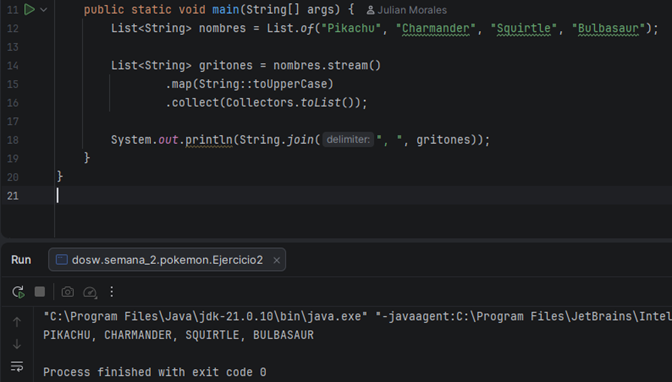

**Explicacion:**
Se aplica `map(String::toUpperCase)` a cada nombre del stream y se unen con `String.join` para mostrarlos.

---

### Ejercicio 03 — Poder Total del Equipo
**Operadores utilizados:** `reduce()`

Dada una lista de niveles de Pokemon, calcular la suma total de niveles del equipo.

**Codigo implementado:**
```java
package dosw.semana_2.pokemon;

import java.util.List;

/**
 * Ejercicio 03 - Poder Total del Equipo
 * Operador: reduce()
 */
public class Ejercicio3 {
    public static void main(String[] args) {
        List<Integer> niveles = List.of(45, 62, 38, 71, 55, 29);

        int sumaTotal = niveles.stream()
                .reduce(0, Integer::sum);

        System.out.println("Suma total de niveles: " + sumaTotal);
    }
}
```

**Captura de ejecucion:**

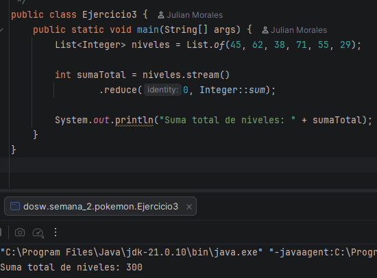

**Explicacion:**
`reduce(0, Integer::sum)` acumula el total sumando cada nivel del stream, partiendo de un valor identidad de 0.

---

### Ejercicio 04 — Pokemon Alfa
**Operadores utilizados:** `max(Comparator)`

Encontrar el Pokemon con el nivel mas alto dentro del equipo.

**Codigo implementado:**
```java
package dosw.semana_2.pokemon;

import java.util.Comparator;
import java.util.List;
import java.util.Optional;

/**
 * Ejercicio 04 - Pokemon Alfa
 * Operador: max(Comparator)
 */
public class Ejercicio4 {

    record PokemonNivel(String nombre, int nivel) {}

    public static void main(String[] args) {
        List<PokemonNivel> equipo = List.of(
                new PokemonNivel("Pikachu", 45),
                new PokemonNivel("Charmander", 62),
                new PokemonNivel("Squirtle", 38),
                new PokemonNivel("Snorlax", 90),
                new PokemonNivel("Mewtwo", 88)
        );

        Optional<PokemonNivel> alfa = equipo.stream()
                .max(Comparator.comparingInt(PokemonNivel::nivel));

        alfa.ifPresent(p -> System.out.println("Pokemon Alfa: " + p.nombre() + " (nivel " + p.nivel() + ")"));
    }
}
```

**Captura de ejecucion:**

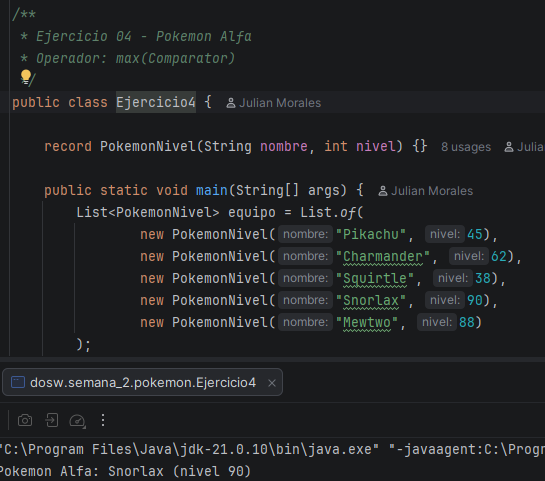

**Explicacion:**
`max(Comparator.comparingInt(...))` recorre el stream comparando niveles y retorna un `Optional` con el Pokemon de mayor nivel.

---

### Ejercicio 05 — Pokemon Legendarios
**Operadores utilizados:** `filter() + count()`

Contar cuantos Pokemon del equipo tienen nivel superior a 80.

**Codigo implementado:**
```java
package dosw.semana_2.pokemon;

import java.util.List;

/**
 * Ejercicio 05 - Pokemon Legendarios
 * Operadores: filter() + count()
 */
public class Ejercicio5 {

    record PokemonNivel(String nombre, int nivel) {}

    public static void main(String[] args) {
        List<PokemonNivel> equipo = List.of(
                new PokemonNivel("Pikachu", 45),
                new PokemonNivel("Mewtwo", 88),
                new PokemonNivel("Dragonite", 82),
                new PokemonNivel("Squirtle", 38),
                new PokemonNivel("Mew", 85),
                new PokemonNivel("Charmander", 62)
        );

        long cantidad = equipo.stream()
                .filter(p -> p.nivel() > 80)
                .count();

        List<String> nombres = equipo.stream()
                .filter(p -> p.nivel() > 80)
                .map(PokemonNivel::nombre)
                .toList();

        System.out.println("Pokemon con nivel > 80: " + cantidad + " " + nombres);
    }
}
```

**Captura de ejecucion:**

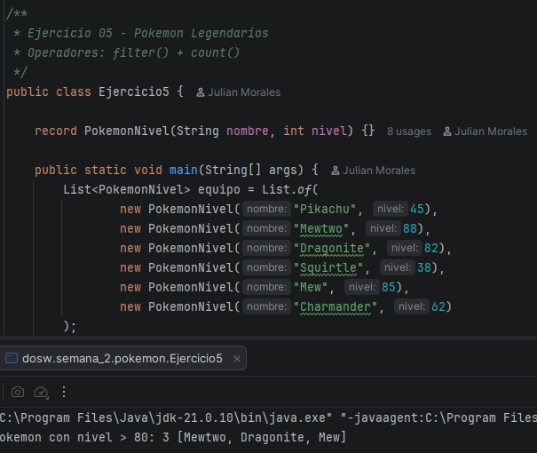

**Explicacion:**
`filter()` deja solo los Pokemon con nivel > 80 y `count()` obtiene la cantidad total que cumple la condicion.

---

## Nivel 2 — Entrenador Intermedio
_Filtrado y ordenamiento avanzado_

### Ejercicio 06 — Pokedex Sin Duplicados
**Operadores utilizados:** `distinct()`

Dada una lista de Pokemon con elementos repetidos, generar una nueva coleccion donde cada Pokemon aparezca una sola vez.

**Codigo implementado:**
```java
package dosw.semana_2.pokemon;

import java.util.List;
import java.util.stream.Collectors;

/**
 * Ejercicio 06 - Pokedex Sin Duplicados
 * Operador: distinct()
 */
public class Ejercicio6 {
    public static void main(String[] args) {
        List<String> pokedex = List.of("Pikachu", "Charmander", "Pikachu", "Squirtle", "Charmander", "Mewtwo");

        List<String> sinDuplicados = pokedex.stream()
                .distinct()
                .collect(Collectors.toList());

        System.out.println(sinDuplicados);
    }
}
```

**Captura de ejecucion:**

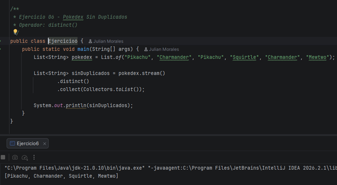

**Explicacion:**
`distinct()` elimina los duplicados del stream basandose en el `equals()` de `String`, preservando el primer orden de aparicion.

---

### Ejercicio 07 — Orden del Profesor Oak
**Operadores utilizados:** `sorted()`

Ordenar alfabeticamente los nombres de los Pokemon.

**Codigo implementado:**
```java
package dosw.semana_2.pokemon;

import java.util.List;
import java.util.stream.Collectors;

/**
 * Ejercicio 07 - Orden del Profesor Oak
 * Operador: sorted()
 */
public class Ejercicio7 {
    public static void main(String[] args) {
        List<String> pokedex = List.of("Squirtle", "Pikachu", "Mewtwo", "Bulbasaur", "Charmander", "Abra");

        List<String> ordenada = pokedex.stream()
                .sorted()
                .collect(Collectors.toList());

        System.out.println(ordenada);
    }
}
```

**Captura de ejecucion:**

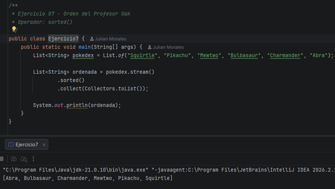

**Explicacion:**
`sorted()` aplica el orden natural (alfabetico) de `String` sobre el stream de nombres.

---

### Ejercicio 08 — Evoluciones Preparadas
**Operadores utilizados:** `filter()`

Dada una lista de Pokemon con el atributo `puedeEvolucionar`, obtener unicamente los que esten listos para evolucionar.

**Codigo implementado:**
```java
package dosw.semana_2.pokemon;

import java.util.List;
import java.util.stream.Collectors;

/**
 * Ejercicio 08 - Evoluciones Preparadas
 * Operador: filter()
 */
public class Ejercicio8 {

    record PokemonEvolucion(String nombre, boolean puedeEvolucionar) {}

    public static void main(String[] args) {
        List<PokemonEvolucion> equipo = List.of(
                new PokemonEvolucion("Pikachu", true),
                new PokemonEvolucion("Raichu", false),
                new PokemonEvolucion("Charmander", true),
                new PokemonEvolucion("Charizard", false),
                new PokemonEvolucion("Squirtle", true),
                new PokemonEvolucion("Blastoise", false)
        );

        List<String> listos = equipo.stream()
                .filter(PokemonEvolucion::puedeEvolucionar)
                .map(PokemonEvolucion::nombre)
                .collect(Collectors.toList());

        System.out.println("Listos para evolucionar: " + listos);
    }
}
```

**Captura de ejecucion:**

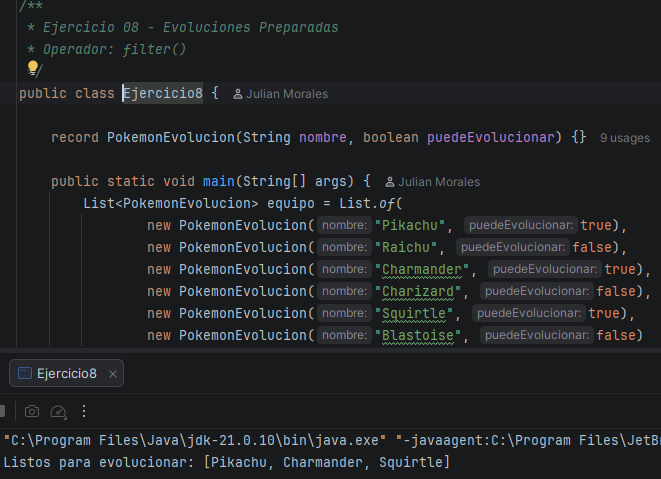

**Explicacion:**
`filter(PokemonEvolucion::puedeEvolucionar)` usa una method reference sobre el record para dejar solo los Pokemon listos para evolucionar.

---

## Nivel 3 — Lider de Gimnasio
_Manipulacion de objetos complejos_

### Ejercicio 09 — Equipo Elite
**Operadores utilizados:** `filter()`

Mostrar unicamente los Pokemon cuyo poderCombate sea superior a 500. A partir de aqui se usa la clase `Pokemon`.

**Codigo implementado:**
```java
package dosw.semana_2.pokemon;

import java.util.List;
import java.util.stream.Collectors;

/**
 * Ejercicio 09 - Equipo Elite
 * Operador: filter()
 */
public class Ejercicio9 {
    public static void main(String[] args) {
        List<Pokemon> equipo = List.of(
                new Pokemon(1L, "Pikachu", "Electrico", 45, 320, "Kanto", false),
                new Pokemon(2L, "Mewtwo", "Psiquico", 70, 680, "Kanto", true),
                new Pokemon(3L, "Dragonite", "Dragon", 55, 530, "Kanto", false),
                new Pokemon(4L, "Squirtle", "Agua", 20, 210, "Kanto", false),
                new Pokemon(5L, "Gengar", "Fantasma", 40, 495, "Kanto", false),
                new Pokemon(6L, "Charizard", "Fuego", 58, 610, "Kanto", false)
        );

        List<Pokemon> equipoElite = equipo.stream()
                .filter(p -> p.getPoderCombate() > 500)
                .collect(Collectors.toList());

        System.out.println("Equipo Elite (PC > 500): " + equipoElite);
    }
}
```

**Captura de ejecucion:**

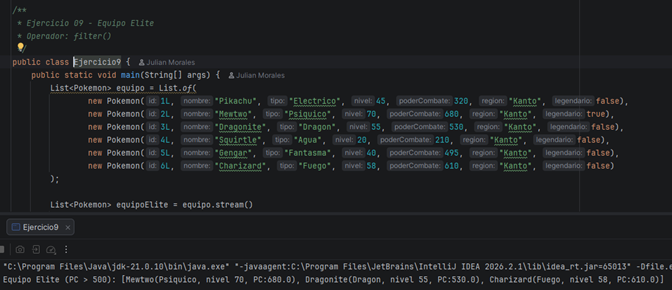

**Explicacion:**
Se filtra el stream de objetos `Pokemon` comparando `getPoderCombate()` contra 500.

---

### Ejercicio 10 — Pokedex Compacta
**Operadores utilizados:** `map() + collect()`

Generar una lista que contenga unicamente los nombres de todos los Pokemon del equipo.

**Codigo implementado:**
```java
package dosw.semana_2.pokemon;

import java.util.List;
import java.util.stream.Collectors;

/**
 * Ejercicio 10 - Pokedex Compacta
 * Operadores: map() + collect()
 */
public class Ejercicio10 {
    public static void main(String[] args) {
        List<Pokemon> equipo = List.of(
                new Pokemon(1L, "Pikachu", "Electrico", 45, 320, "Kanto", false),
                new Pokemon(2L, "Mewtwo", "Psiquico", 70, 680, "Kanto", true),
                new Pokemon(3L, "Dragonite", "Dragon", 55, 530, "Kanto", false),
                new Pokemon(4L, "Squirtle", "Agua", 20, 210, "Kanto", false),
                new Pokemon(5L, "Gengar", "Fantasma", 40, 495, "Kanto", false),
                new Pokemon(6L, "Charizard", "Fuego", 58, 610, "Kanto", false)
        );

        List<String> nombres = equipo.stream()
                .map(Pokemon::getNombre)
                .collect(Collectors.toList());

        System.out.println(nombres);
    }
}
```

**Captura de ejecucion:**

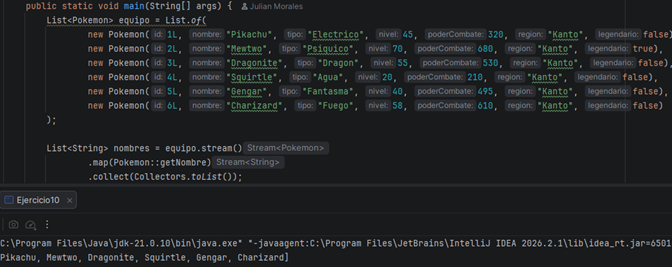

**Explicacion:**
`map(Pokemon::getNombre)` proyecta cada objeto `Pokemon` a su nombre, y `collect()` construye la lista final de Strings.

---

### Ejercicio 11 — Poder Promedio
**Operadores utilizados:** `mapToDouble() + average()`

Calcular el promedio de poderCombate de todos los Pokemon del equipo.

**Codigo implementado:**
```java
package dosw.semana_2.pokemon;

import java.util.List;
import java.util.OptionalDouble;

/**
 * Ejercicio 11 - Poder Promedio
 * Operadores: mapToDouble() + average()
 */
public class Ejercicio11 {
    public static void main(String[] args) {
        List<Pokemon> equipo = List.of(
                new Pokemon(1L, "Pikachu", "Electrico", 45, 320, "Kanto", false),
                new Pokemon(2L, "Mewtwo", "Psiquico", 70, 680, "Kanto", true),
                new Pokemon(3L, "Dragonite", "Dragon", 55, 530, "Kanto", false),
                new Pokemon(4L, "Squirtle", "Agua", 20, 210, "Kanto", false),
                new Pokemon(5L, "Gengar", "Fantasma", 40, 495, "Kanto", false),
                new Pokemon(6L, "Charizard", "Fuego", 58, 610, "Kanto", false)
        );

        OptionalDouble promedio = equipo.stream()
                .mapToDouble(Pokemon::getPoderCombate)
                .average();

        promedio.ifPresent(p -> System.out.printf("Poder de combate promedio: %.2f%n", p));
    }
}
```

**Captura de ejecucion:**

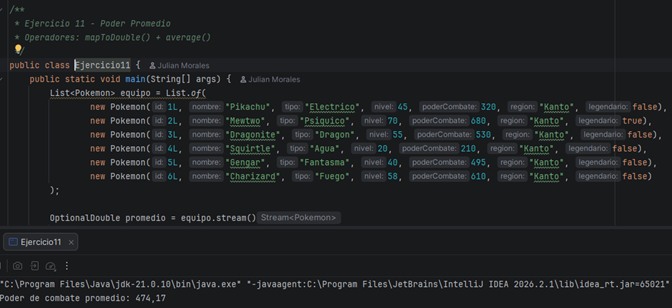

**Explicacion:**
`mapToDouble()` convierte el stream de objetos en un `DoubleStream` con el poder de combate, y `average()` calcula el promedio como `OptionalDouble`.

---

### Ejercicio 12 — Campeon Regional
**Operadores utilizados:** `max(Comparator)`

Obtener el Pokemon con mayor poderCombate de toda la lista.

**Codigo implementado:**
```java
package dosw.semana_2.pokemon;

import java.util.Comparator;
import java.util.List;
import java.util.Optional;

/**
 * Ejercicio 12 - Campeon Regional
 * Operador: max(Comparator)
 */
public class Ejercicio12 {
    public static void main(String[] args) {
        List<Pokemon> equipo = List.of(
                new Pokemon(1L, "Pikachu", "Electrico", 45, 320, "Kanto", false),
                new Pokemon(2L, "Mewtwo", "Psiquico", 70, 680, "Kanto", true),
                new Pokemon(3L, "Dragonite", "Dragon", 55, 530, "Kanto", false),
                new Pokemon(4L, "Charizard", "Fuego", 58, 610, "Kanto", false)
        );

        Optional<Pokemon> campeon = equipo.stream()
                .max(Comparator.comparingDouble(Pokemon::getPoderCombate));

        campeon.ifPresent(p -> System.out.println("Campeon: " + p.getNombre() + " con PC: " + p.getPoderCombate()));
    }
}
```

**Captura de ejecucion:**

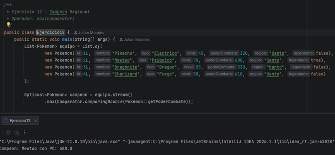

**Explicacion:**
`max(Comparator.comparingDouble(Pokemon::getPoderCombate))` retorna el Pokemon con el poder de combate mas alto.

---

### Ejercicio 13 — Organizar por Tipo
**Operadores utilizados:** `groupingBy()`

Agrupar todos los Pokemon por su tipo y mostrar el listado por grupo.

**Codigo implementado:**
```java
package dosw.semana_2.pokemon;

import java.util.List;
import java.util.Map;
import java.util.stream.Collectors;

/**
 * Ejercicio 13 - Organizar por Tipo
 * Operador: groupingBy()
 */
public class Ejercicio13 {
    public static void main(String[] args) {
        List<Pokemon> equipo = List.of(
                new Pokemon(1L, "Squirtle", "Agua", 20, 210, "Kanto", false),
                new Pokemon(2L, "Psyduck", "Agua", 25, 260, "Kanto", false),
                new Pokemon(3L, "Charmander", "Fuego", 30, 300, "Kanto", false),
                new Pokemon(4L, "Vulpix", "Fuego", 22, 240, "Kanto", false),
                new Pokemon(5L, "Bulbasaur", "Planta", 28, 280, "Kanto", false)
        );

        Map<String, List<String>> porTipo = equipo.stream()
                .collect(Collectors.groupingBy(Pokemon::getTipo,
                        Collectors.mapping(Pokemon::getNombre, Collectors.toList())));

        porTipo.forEach((tipo, nombres) -> System.out.println(tipo + ": " + nombres));
    }
}
```

**Captura de ejecucion:**

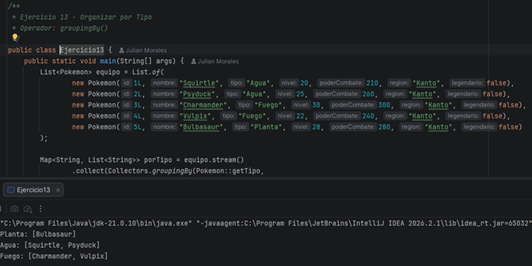

**Explicacion:**
`Collectors.groupingBy(Pokemon::getTipo, Collectors.mapping(...))` agrupa los Pokemon en un `Map<String, List<String>>` segun su tipo.

---

### Ejercicio 14 — Organizar por Region
**Operadores utilizados:** `groupingBy()`

Agrupar los Pokemon segun su region de origen. A partir de aqui se usa tambien la clase `Entrenador`.

**Codigo implementado:**
```java
package dosw.semana_2.pokemon;

import java.util.List;
import java.util.Map;
import java.util.stream.Collectors;

/**
 * Ejercicio 14 - Organizar por Region
 * Operador: groupingBy()
 */
public class Ejercicio14 {
    public static void main(String[] args) {
        List<Pokemon> equipo = List.of(
                new Pokemon(1L, "Pikachu", "Electrico", 45, 320, "Kanto", false),
                new Pokemon(2L, "Chikorita", "Planta", 20, 210, "Johto", false),
                new Pokemon(3L, "Torchic", "Fuego", 22, 230, "Hoenn", false),
                new Pokemon(4L, "Piplup", "Agua", 20, 200, "Sinnoh", false),
                new Pokemon(5L, "Charmander", "Fuego", 30, 300, "Kanto", false),
                new Pokemon(6L, "Totodile", "Agua", 24, 250, "Johto", false)
        );

        Map<String, List<String>> porRegion = equipo.stream()
                .collect(Collectors.groupingBy(Pokemon::getRegion,
                        Collectors.mapping(Pokemon::getNombre, Collectors.toList())));

        porRegion.forEach((region, nombres) -> System.out.println(region + ": " + nombres));
    }
}
```

**Captura de ejecucion:**

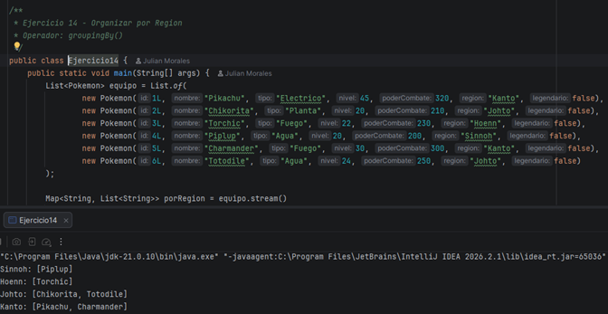

**Explicacion:**
Misma estrategia que el ejercicio 13 pero agrupando por `getRegion()` en lugar de `getTipo()`.

---

## Nivel 4 — Alto Mando
_Objetos anidados y comparaciones_

### Ejercicio 15 — Maestro de Gimnasios
**Operadores utilizados:** `max(Comparator)`

Dado un listado de entrenadores con sus medallas, encontrar el entrenador con mas medallas.

**Codigo implementado:**
```java
package dosw.semana_2.pokemon;

import java.util.Comparator;
import java.util.List;
import java.util.Optional;

/**
 * Ejercicio 15 - Maestro de Gimnasios
 * Operador: max(Comparator)
 */
public class Ejercicio15 {
    public static void main(String[] args) {
        List<Entrenador> entrenadores = List.of(
                new Entrenador(1L, "Ash", 8, List.of()),
                new Entrenador(2L, "Misty", 5, List.of()),
                new Entrenador(3L, "Brock", 6, List.of()),
                new Entrenador(4L, "Gary", 10, List.of())
        );

        Optional<Entrenador> campeon = entrenadores.stream()
                .max(Comparator.comparingInt(Entrenador::getMedallas));

        campeon.ifPresent(e -> System.out.println("Campeon de gimnasios: " + e.getNombre()
                + "\nMedallas obtenidas: " + e.getMedallas()));
    }
}
```

**Captura de ejecucion:**

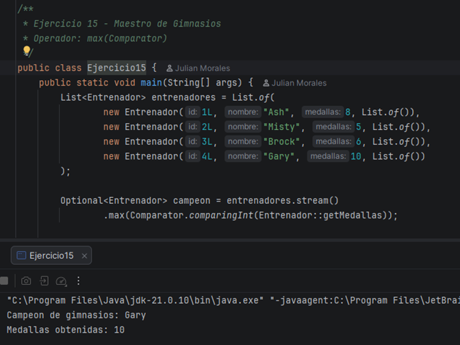

**Explicacion:**
`max(Comparator.comparingInt(Entrenador::getMedallas))` recorre el stream de entrenadores y retorna el de mayor numero de medallas.

---

### Ejercicio 16 — Entrenadores Experimentados
**Operadores utilizados:** `filter()`

Mostrar unicamente los entrenadores que posean mas de 5 medallas.

**Codigo implementado:**
```java
package dosw.semana_2.pokemon;

import java.util.List;
import java.util.stream.Collectors;

/**
 * Ejercicio 16 - Entrenadores Experimentados
 * Operador: filter()
 */
public class Ejercicio16 {
    public static void main(String[] args) {
        List<Entrenador> entrenadores = List.of(
                new Entrenador(1L, "Ash", 8, List.of()),
                new Entrenador(2L, "Misty", 5, List.of()),
                new Entrenador(3L, "Brock", 6, List.of()),
                new Entrenador(4L, "Gary", 10, List.of()),
                new Entrenador(5L, "May", 3, List.of()),
                new Entrenador(6L, "Dawn", 7, List.of())
        );

        List<Entrenador> experimentados = entrenadores.stream()
                .filter(e -> e.getMedallas() > 5)
                .collect(Collectors.toList());

        System.out.println("Entrenadores con > 5 medallas: " + experimentados);
    }
}
```

**Captura de ejecucion:**

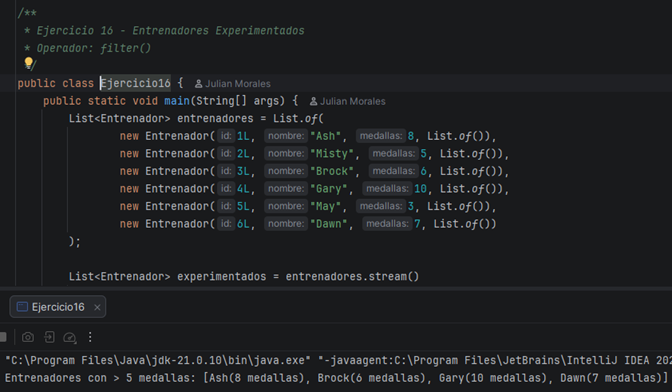

**Explicacion:**
`filter(e -> e.getMedallas() > 5)` deja solo los entrenadores que superan las 5 medallas.

---

### Ejercicio 17 — Equipo Mas Poderoso
**Operadores utilizados:** `mapToDouble() + sum()`

Calcular cual entrenador tiene la suma total de poderCombate mas alta entre todos sus Pokemon.

**Codigo implementado:**
```java
package dosw.semana_2.pokemon;

import java.util.Comparator;
import java.util.List;
import java.util.Optional;

/**
 * Ejercicio 17 - Equipo Mas Poderoso
 * Operadores: mapToDouble() + sum()
 */
public class Ejercicio17 {
    public static void main(String[] args) {
        List<Entrenador> entrenadores = List.of(
                new Entrenador(1L, "Ash", 8, List.of(
                        new Pokemon(1L, "Pikachu", "Electrico", 45, 850, "Kanto", false),
                        new Pokemon(2L, "Charizard", "Fuego", 58, 1000, "Kanto", false)
                )),
                new Entrenador(2L, "Gary", 10, List.of(
                        new Pokemon(3L, "Blastoise", "Agua", 60, 1200, "Kanto", false),
                        new Pokemon(4L, "Nidoking", "Veneno", 55, 1140, "Kanto", false)
                )),
                new Entrenador(3L, "Brock", 6, List.of(
                        new Pokemon(5L, "Onix", "Roca", 50, 900, "Kanto", false),
                        new Pokemon(6L, "Geodude", "Roca", 40, 770, "Kanto", false)
                ))
        );

        Optional<Entrenador> masPoderoso = entrenadores.stream()
                .max(Comparator.comparingDouble(e -> e.getEquipo().stream()
                        .mapToDouble(Pokemon::getPoderCombate)
                        .sum()));

        masPoderoso.ifPresent(e -> {
            double poder = e.getEquipo().stream().mapToDouble(Pokemon::getPoderCombate).sum();
            System.out.println("Entrenador mas poderoso: " + e.getNombre());
            System.out.println("Poder acumulado del equipo: " + poder);
        });
    }
}
```

**Captura de ejecucion:**

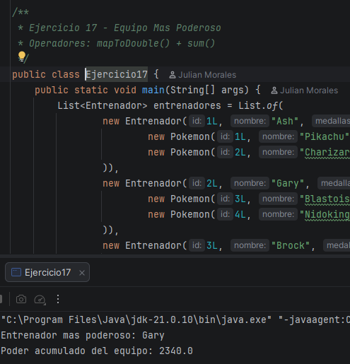

**Explicacion:**
Para cada entrenador se calcula la suma de poder de su equipo con un stream anidado (`mapToDouble().sum()`), y `max(Comparator.comparingDouble(...))` determina cual entrenador tiene el total mas alto.

---

## Nivel 5 — Campeon de la Liga Pokemon DOSW
_Analisis avanzado y rankings_

### Ejercicio 18 — Top 5 Pokemon Mas Fuertes
**Operadores utilizados:** `sorted() + limit(5)`

Generar un ranking de los cinco Pokemon con mayor poderCombate de toda la Pokedex.

**Codigo implementado:**
```java
package dosw.semana_2.pokemon;

import java.util.Comparator;
import java.util.List;
import java.util.stream.IntStream;

/**
 * Ejercicio 18 - Top 5 Pokemon Mas Fuertes
 * Operadores: sorted() + limit(5)
 */
public class Ejercicio18 {
    public static void main(String[] args) {
        List<Pokemon> pokedex = List.of(
                new Pokemon(1L, "Pikachu", "Electrico", 45, 320, "Kanto", false),
                new Pokemon(2L, "Mewtwo", "Psiquico", 70, 680, "Kanto", true),
                new Pokemon(3L, "Dragonite", "Dragon", 55, 530, "Kanto", false),
                new Pokemon(4L, "Squirtle", "Agua", 20, 210, "Kanto", false),
                new Pokemon(5L, "Gengar", "Fantasma", 40, 495, "Kanto", false),
                new Pokemon(6L, "Charizard", "Fuego", 58, 610, "Kanto", false)
        );

        List<Pokemon> top5 = pokedex.stream()
                .sorted(Comparator.comparingDouble(Pokemon::getPoderCombate).reversed())
                .limit(5)
                .toList();

        IntStream.range(0, top5.size())
                .mapToObj(i -> "#" + (i + 1) + " " + top5.get(i).getNombre()
                        + " -- PC: " + (int) top5.get(i).getPoderCombate())
                .forEach(System.out::println);
    }
}
```

**Captura de ejecucion:**

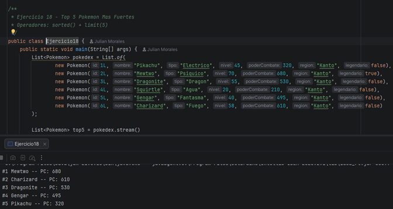

**Explicacion:**
`sorted(Comparator.comparingDouble(Pokemon::getPoderCombate).reversed())` ordena de mayor a menor poder, y `limit(5)` se queda con los primeros cinco. El ranking se imprime con `IntStream.range()` para evitar ciclos tradicionales.

---

### Ejercicio 19 — Top 3 Entrenadores
**Operadores utilizados:** `sorted() + limit(3)`

Generar un ranking de los 3 mejores entrenadores considerando: 1 mas medallas, 2 mayor poder acumulado, 3 orden alfabetico como criterio de desempate.

**Codigo implementado:**
```java
package dosw.semana_2.pokemon;

import java.util.Comparator;
import java.util.List;
import java.util.stream.IntStream;

/**
 * Ejercicio 19 - Top 3 Entrenadores
 * Operadores: sorted() + limit(3)
 */
public class Ejercicio19 {

    record EntrenadorRanking(String nombre, int medallas, double poderAcumulado) {}

    public static void main(String[] args) {
        List<EntrenadorRanking> entrenadores = List.of(
                new EntrenadorRanking("Gary", 10, 2340),
                new EntrenadorRanking("Ash", 8, 1850),
                new EntrenadorRanking("Dawn", 7, 2100),
                new EntrenadorRanking("Brock", 6, 1670)
        );

        Comparator<EntrenadorRanking> criterio = Comparator
                .comparingInt(EntrenadorRanking::medallas).reversed()
                .thenComparing(Comparator.comparingDouble(EntrenadorRanking::poderAcumulado).reversed())
                .thenComparing(EntrenadorRanking::nombre);

        List<EntrenadorRanking> top3 = entrenadores.stream()
                .sorted(criterio)
                .limit(3)
                .toList();

        IntStream.range(0, top3.size())
                .mapToObj(i -> "#" + (i + 1) + " " + top3.get(i).nombre()
                        + " -- " + top3.get(i).medallas() + " medallas, PC: " + (int) top3.get(i).poderAcumulado())
                .forEach(System.out::println);
    }
}
```

**Captura de ejecucion:**

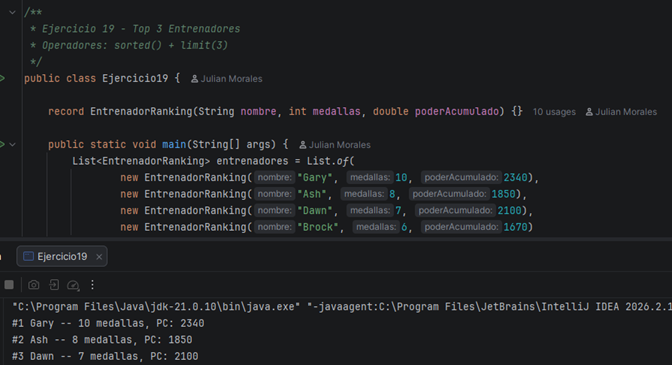

**Explicacion:**
Se construye un `Comparator` compuesto con `thenComparing()` que aplica los tres criterios en cascada (medallas desc, poder desc, nombre asc), y luego `sorted().limit(3)` obtiene el podio.

---

### Ejercicio 20 — Pokedex Analitica
**Operadores utilizados:** `groupingBy() + counting()`

Construir una estructura que muestre: cantidad de Pokemon por tipo, por region, cantidad de legendarios, promedio de nivel y el Pokemon mas fuerte, todo usando unicamente Streams.

**Codigo implementado:**
```java
package dosw.semana_2.pokemon;

import java.util.Comparator;
import java.util.List;
import java.util.Map;
import java.util.stream.Collectors;

/**
 * Ejercicio 20 - Pokedex Analitica
 * Operadores: groupingBy() + counting()
 */
public class Ejercicio20 {
    public static void main(String[] args) {
        List<Pokemon> pokedex = List.of(
                new Pokemon(1L, "Charmander", "Fuego", 30, 300, "Kanto", false),
                new Pokemon(2L, "Vulpix", "Fuego", 22, 240, "Kanto", false),
                new Pokemon(3L, "Squirtle", "Agua", 20, 210, "Kanto", false),
                new Pokemon(4L, "Psyduck", "Agua", 25, 260, "Kanto", false),
                new Pokemon(5L, "Bulbasaur", "Planta", 28, 280, "Kanto", false),
                new Pokemon(6L, "Mewtwo", "Psiquico", 70, 680, "Kanto", true),
                new Pokemon(7L, "Mew", "Psiquico", 65, 600, "Kanto", true)
        );

        Map<String, Long> porTipo = pokedex.stream()
                .collect(Collectors.groupingBy(Pokemon::getTipo, Collectors.counting()));

        Map<String, Long> porRegion = pokedex.stream()
                .collect(Collectors.groupingBy(Pokemon::getRegion, Collectors.counting()));

        long legendarios = pokedex.stream()
                .filter(Pokemon::isLegendario)
                .count();

        double promedioNivel = pokedex.stream()
                .mapToInt(Pokemon::getNivel)
                .average()
                .orElse(0);

        String masFuerte = pokedex.stream()
                .max(Comparator.comparingDouble(Pokemon::getPoderCombate))
                .map(p -> p.getNombre() + " (PC: " + (int) p.getPoderCombate() + ")")
                .orElse("N/A");

        System.out.println("Por tipo: " + porTipo);
        System.out.println("Por region: " + porRegion);
        System.out.println("Legendarios: " + legendarios);
        System.out.printf("Promedio nivel: %.2f%n", promedioNivel);
        System.out.println("Mas fuerte: " + masFuerte);
    }
}
```

**Captura de ejecucion:**

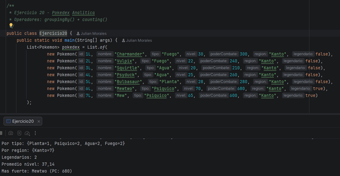

**Explicacion:**
Se combinan varios pipelines independientes sobre la misma lista: `groupingBy()+counting()` para los conteos por tipo y region, `filter()+count()` para los legendarios, `mapToInt().average()` para el promedio de nivel, y `max(Comparator...)` para el Pokemon mas fuerte.

---

# SEMANA No 4 — Patrones de Diseno Combinados

## Datos del estudiante:
- Nombre y Apellido: Julian Morales
- Codigo de Estudiante: 1000091825
- Curso: DOSW

Cada ejercicio combina exactamente 2 patrones de diseno para resolver un caso real. Para cada uno se documenta: el rol de cada patron, como interactuan entre si, el codigo funcional que los implementa y por que esa combinacion es superior a resolverlo sin patrones.

---

### Ejercicio 01 — Plataforma de Pagos Inteligentes
**Patrones combinados:** Strategy + Factory Method

Una aplicacion de e-commerce permite pagar con tarjeta, PSE, Nequi y PayPal. Cada medio tiene una logica distinta pero el flujo de compra es el mismo. Segun el pais del usuario, el sistema construye el proveedor de pago correcto (Colombia -> PSE/Nequi, USA -> PayPal).

**Rol de cada patron:**
**Strategy** encapsula cada algoritmo de pago en una clase independiente (`TarjetaStrategy`, `PseStrategy`, `NequiStrategy`, `PayPalStrategy`); el `Checkout` trabaja contra la interfaz `PaymentStrategy` sin importar cual medio se use. **Factory Method** (`ColombiaPaymentFactory`, `UsaPaymentFactory`) crea el proveedor correcto segun el pais, para que el cliente no tenga que saber que clase concreta instanciar.

**Como interactuan:**
El usuario selecciona su pais -> la Factory construye el gateway correcto -> ese gateway implementa `PaymentStrategy` -> el `Checkout` llama `strategy.process(amount)` sin conocer la implementacion concreta.

**Codigo implementado:**
```java
package dosw.semana_4.patrones.ejercicio1;

/**
 * Ejercicio 01 - Plataforma de Pagos Inteligentes
 * Patrones: Strategy + Factory Method
 */
public class Ejercicio1 {

    interface PaymentStrategy { void process(double amount); }

    static class TarjetaStrategy implements PaymentStrategy {
        public void process(double amount) {
            System.out.println("Pago de $" + amount + " procesado con Tarjeta de Credito");
        }
    }
    static class PseStrategy implements PaymentStrategy {
        public void process(double amount) {
            System.out.println("Pago de $" + amount + " procesado con PSE");
        }
    }
    static class NequiStrategy implements PaymentStrategy {
        public void process(double amount) {
            System.out.println("Pago de $" + amount + " procesado con Nequi");
        }
    }
    static class PayPalStrategy implements PaymentStrategy {
        public void process(double amount) {
            System.out.println("Payment of $" + amount + " processed with PayPal");
        }
    }

    interface PaymentFactory { PaymentStrategy create(String metodo); }

    static class ColombiaPaymentFactory implements PaymentFactory {
        public PaymentStrategy create(String metodo) {
            return switch (metodo) {
                case "TARJETA" -> new TarjetaStrategy();
                case "PSE" -> new PseStrategy();
                case "NEQUI" -> new NequiStrategy();
                default -> throw new IllegalArgumentException("Metodo no soportado en Colombia: " + metodo);
            };
        }
    }
    static class UsaPaymentFactory implements PaymentFactory {
        public PaymentStrategy create(String metodo) {
            return switch (metodo) {
                case "PAYPAL" -> new PayPalStrategy();
                default -> throw new IllegalArgumentException("Metodo no soportado en USA: " + metodo);
            };
        }
    }

    static class Checkout {
        private final PaymentStrategy strategy;
        Checkout(PaymentStrategy strategy) { this.strategy = strategy; }
        void pay(double amount) { strategy.process(amount); }
    }

    public static void main(String[] args) {
        PaymentFactory factoryColombia = new ColombiaPaymentFactory();
        Checkout checkout1 = new Checkout(factoryColombia.create("NEQUI"));
        checkout1.pay(150000);

        PaymentFactory factoryUsa = new UsaPaymentFactory();
        Checkout checkout2 = new Checkout(factoryUsa.create("PAYPAL"));
        checkout2.pay(49.99);
    }
}
```

**Captura de ejecucion:**

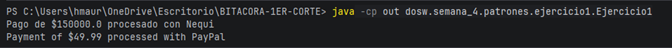

**Justificacion — por que esta combinacion es superior a resolverlo sin patrones:**
Sin Factory, el `Checkout` tendria que conocer que Strategy instanciar segun el pais, acoplando la logica de seleccion de pais con la logica de pago. Separando ambas responsabilidades, agregar un nuevo pais o un nuevo medio de pago no obliga a tocar el `Checkout`.

---

### Ejercicio 02 — Sistema de Notificaciones Multicanal
**Patrones combinados:** Observer + Factory Method

Cuando un pedido cambia de estado (pendiente -> enviado -> entregado), el sistema notifica por correo, SMS y push. No todos los usuarios tienen activos los mismos canales, y cada canal formatea el mensaje distinto.

**Rol de cada patron:**
**Observer** desacopla el `Pedido` (Subject) de los canales: `EmailNotifier`, `SmsNotifier` y `PushNotifier` son Observers que reaccionan cuando el pedido cambia de estado, sin que el Pedido conozca sus detalles. **Factory Method** (`EmailMessageFactory`, `SmsMessageFactory`, `PushMessageFactory`) construye el mensaje con el formato correcto para cada canal (HTML, texto plano, JSON).

**Como interactuan:**
El Pedido cambia de estado -> notifica a todos los Observers activos -> cada Observer usa su propia Factory para construir el mensaje correcto para su canal -> lo envia.

**Codigo implementado:**
```java
package dosw.semana_4.patrones.ejercicio2;

import java.util.ArrayList;
import java.util.List;

/**
 * Ejercicio 02 - Sistema de Notificaciones Multicanal
 * Patrones: Observer + Factory Method
 */
public class Ejercicio2 {

    static class OrderEvent {
        String estado;
        OrderEvent(String estado) { this.estado = estado; }
    }

    interface Message { String build(); }
    static class EmailMessage implements Message {
        OrderEvent event;
        EmailMessage(OrderEvent e) { event = e; }
        public String build() { return "<html><body>Tu pedido cambio a: " + event.estado + "</body></html>"; }
    }
    static class SmsMessage implements Message {
        OrderEvent event;
        SmsMessage(OrderEvent e) { event = e; }
        public String build() {
            String texto = "Pedido: " + event.estado;
            return texto.length() > 160 ? texto.substring(0, 160) : texto;
        }
    }
    static class PushMessage implements Message {
        OrderEvent event;
        PushMessage(OrderEvent e) { event = e; }
        public String build() { return "{\"estado\":\"" + event.estado + "\"}"; }
    }

    interface MessageFactory { Message build(OrderEvent event); }
    static class EmailMessageFactory implements MessageFactory {
        public Message build(OrderEvent event) { return new EmailMessage(event); }
    }
    static class SmsMessageFactory implements MessageFactory {
        public Message build(OrderEvent event) { return new SmsMessage(event); }
    }
    static class PushMessageFactory implements MessageFactory {
        public Message build(OrderEvent event) { return new PushMessage(event); }
    }

    interface NotificationObserver { void notify(OrderEvent event); }
    static class EmailNotifier implements NotificationObserver {
        MessageFactory factory = new EmailMessageFactory();
        public void notify(OrderEvent event) {
            System.out.println("[EMAIL] " + factory.build(event).build());
        }
    }
    static class SmsNotifier implements NotificationObserver {
        MessageFactory factory = new SmsMessageFactory();
        public void notify(OrderEvent event) {
            System.out.println("[SMS] " + factory.build(event).build());
        }
    }
    static class PushNotifier implements NotificationObserver {
        MessageFactory factory = new PushMessageFactory();
        public void notify(OrderEvent event) {
            System.out.println("[PUSH] " + factory.build(event).build());
        }
    }

    static class Pedido {
        private final List<NotificationObserver> observers = new ArrayList<>();
        void addObserver(NotificationObserver o) { observers.add(o); }
        void cambiarEstado(String estado) {
            OrderEvent event = new OrderEvent(estado);
            for (NotificationObserver o : observers) o.notify(event);
        }
    }

    public static void main(String[] args) {
        Pedido pedido = new Pedido();
        pedido.addObserver(new EmailNotifier());
        pedido.addObserver(new SmsNotifier());
        pedido.addObserver(new PushNotifier());

        pedido.cambiarEstado("enviado");
        pedido.cambiarEstado("entregado");
    }
}
```

**Captura de ejecucion:**

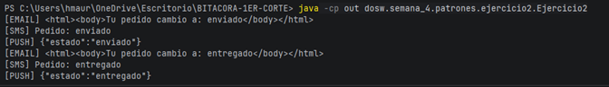

**Justificacion — por que esta combinacion es superior a resolverlo sin patrones:**
Sin Factory, cada Observer tendria la logica de formateo del mensaje dispersa dentro de si mismo. Separando la construccion del mensaje (Factory) de la notificacion (Observer), agregar un canal nuevo (ej. WhatsApp) solo requiere un nuevo Observer + una nueva Factory, sin tocar el Pedido.

---

### Ejercicio 03 — Sistema de Reportes Empresariales
**Patrones combinados:** Template Method + Factory Method

La empresa genera reportes en PDF, Excel y CSV. Todos siguen los mismos 4 pasos (obtener datos, procesar, aplicar formato, exportar), pero cada formato implementa 'aplicar formato' y 'exportar' distinto. El sistema decide dinamicamente que tipo de reporte crear.

**Rol de cada patron:**
**Template Method** define en `ReportGenerator` el metodo final `generate()` que ejecuta los 4 pasos en orden fijo; las subclases (`PdfReport`, `ExcelReport`, `CsvReport`) solo sobreescriben los pasos variables (`applyFormat`, `exportFile`). **Factory Method** (`ReportFactory.create(tipo)`) crea la instancia correcta segun el tipo solicitado, sin que el cliente instancie directamente.

**Como interactuan:**
El cliente pide un reporte por tipo -> la Factory construye la subclase correspondiente -> el cliente llama `generate()` -> el Template Method ejecuta los 4 pasos fijos, usando la implementacion especifica del formato para los pasos variables.

**Codigo implementado:**
```java
package dosw.semana_4.patrones.ejercicio3;

/**
 * Ejercicio 03 - Sistema de Reportes Empresariales
 * Patrones: Template Method + Factory Method
 */
public class Ejercicio3 {

    static abstract class ReportGenerator {
        public final void generate() {
            fetchData();
            processData();
            applyFormat();
            exportFile();
        }
        void fetchData() { System.out.println("Obteniendo datos..."); }
        void processData() { System.out.println("Procesando informacion..."); }
        abstract void applyFormat();
        abstract void exportFile();
    }
    static class PdfReport extends ReportGenerator {
        void applyFormat() { System.out.println("Aplicando formato PDF"); }
        void exportFile() { System.out.println("Exportando reporte.pdf"); }
    }
    static class ExcelReport extends ReportGenerator {
        void applyFormat() { System.out.println("Aplicando formato Excel"); }
        void exportFile() { System.out.println("Exportando reporte.xlsx"); }
    }
    static class CsvReport extends ReportGenerator {
        void applyFormat() { System.out.println("Aplicando formato CSV"); }
        void exportFile() { System.out.println("Exportando reporte.csv"); }
    }

    static class ReportFactory {
        static ReportGenerator create(String tipo) {
            return switch (tipo) {
                case "PDF" -> new PdfReport();
                case "EXCEL" -> new ExcelReport();
                case "CSV" -> new CsvReport();
                default -> throw new IllegalArgumentException("Tipo de reporte no soportado: " + tipo);
            };
        }
    }

    public static void main(String[] args) {
        ReportGenerator reportePdf = ReportFactory.create("PDF");
        System.out.println("--- Generando reporte PDF ---");
        reportePdf.generate();

        ReportGenerator reporteCsv = ReportFactory.create("CSV");
        System.out.println("--- Generando reporte CSV ---");
        reporteCsv.generate();
    }
}
```

**Captura de ejecucion:**

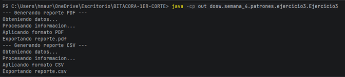

**Justificacion — por que esta combinacion es superior a resolverlo sin patrones:**
Si el algoritmo completo fuera intercambiable se usaria Strategy; aqui el esqueleto (4 pasos) es fijo y solo 2 pasos varian, por eso Template Method es mas preciso. Combinado con Factory, el cliente ni siquiera necesita saber que subclases existen.

---

### Ejercicio 04 — Plataforma de Videojuegos: Personajes
**Patrones combinados:** Builder + Decorator

Un videojuego crea guerreros con armadura, arma y habilidad. El personaje se construye al inicio de la partida, pero sus poderes pueden aumentar dinamicamente durante el juego (escudo, velocidad extra).

**Rol de cada patron:**
**Builder** (`WarriorBuilder`) construye el personaje paso a paso con `setArmor().setWeapon().setSkill().build()`, evitando un constructor con muchos parametros. **Decorator** (`ShieldDecorator`, `SpeedDecorator`) envuelve el personaje ya construido para anadirle poderes temporales en tiempo de ejecucion, sin modificar la clase base.

**Como interactuan:**
El Builder crea el personaje base configurable al inicio de la partida -> durante la partida, los Decorators envuelven el personaje con poderes temporales -> al terminar el efecto, el wrapper se descarta sin afectar la clase base.

**Codigo implementado:**
```java
package dosw.semana_4.patrones.ejercicio4;

/**
 * Ejercicio 04 - Plataforma de Videojuegos: Personajes
 * Patrones: Builder + Decorator
 */
public class Ejercicio4 {

    interface Character { String attack(); }

    static class Warrior implements Character {
        private final String armor;
        private final String weapon;
        private final String skill;
        Warrior(String armor, String weapon, String skill) {
            this.armor = armor; this.weapon = weapon; this.skill = skill;
        }
        public String attack() {
            return "Ataque base (armadura:" + armor + ", arma:" + weapon + ", habilidad:" + skill + ")";
        }
    }

    static class WarriorBuilder {
        private String armor = "ninguna";
        private String weapon = "punios";
        private String skill = "ninguna";
        WarriorBuilder setArmor(String a) { this.armor = a; return this; }
        WarriorBuilder setWeapon(String w) { this.weapon = w; return this; }
        WarriorBuilder setSkill(String s) { this.skill = s; return this; }
        Warrior build() { return new Warrior(armor, weapon, skill); }
    }

    static abstract class CharacterDecorator implements Character {
        protected final Character wrapped;
        CharacterDecorator(Character wrapped) { this.wrapped = wrapped; }
    }
    static class ShieldDecorator extends CharacterDecorator {
        ShieldDecorator(Character c) { super(c); }
        public String attack() { return wrapped.attack() + " + escudo de hielo activo"; }
    }
    static class SpeedDecorator extends CharacterDecorator {
        SpeedDecorator(Character c) { super(c); }
        public String attack() { return wrapped.attack() + " + velocidad extra"; }
    }

    public static void main(String[] args) {
        Character warrior = new WarriorBuilder()
                .setArmor("acero")
                .setWeapon("espada")
                .setSkill("furia")
                .build();

        System.out.println(warrior.attack());

        Character powered = new ShieldDecorator(new SpeedDecorator(warrior));
        System.out.println(powered.attack());
    }
}
```

**Captura de ejecucion:**

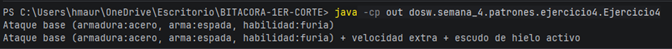

**Justificacion — por que esta combinacion es superior a resolverlo sin patrones:**
Son momentos distintos del ciclo de vida: Builder resuelve la construccion inicial (evita constructores gigantes); Decorator resuelve la variacion dinamica de comportamiento (evita una explosion combinatoria de subclases para cada combinacion de poderes).

---

### Ejercicio 05 — Integracion con Sistema Bancario Antiguo
**Patrones combinados:** Adapter + Facade

El sistema moderno usa `PaymentProcessor` con metodos modernos. El banco antiguo expone `LegacyBankService` con metodos incompatibles y 8 pasos de inicializacion que los desarrolladores no deberian conocer.

**Rol de cada patron:**
**Adapter** (`LegacyBankAdapter`) hace que `LegacyBankService` sea compatible con `PaymentProcessor`, traduciendo internamente el monto a centavos y llamando `executeTransaction`. **Facade** (`BankFacade`) expone un metodo simple `procesarPago(monto)` que orquesta internamente la inicializacion y delega al Adapter, ocultando toda la complejidad.

**Como interactuan:**
El desarrollador llama `BankFacade.procesarPago(monto)` -> la Facade inicializa conexion, sesion y contexto -> delega al `LegacyBankAdapter` -> el Adapter traduce al formato legacy -> `LegacyBankService` ejecuta. El desarrollador nunca toca el servicio legacy.

**Codigo implementado:**
```java
package dosw.semana_4.patrones.ejercicio5;

/**
 * Ejercicio 05 - Integracion con Sistema Bancario Antiguo
 * Patrones: Adapter + Facade
 */
public class Ejercicio5 {

    static class LegacyBankService {
        void executeTransaction(String account, int cents) {
            System.out.println("[LEGACY] Ejecutando transaccion en cuenta " + account + " por " + cents + " centavos");
        }
        boolean verifyBalance(String account, int cents) {
            System.out.println("[LEGACY] Verificando saldo de " + account);
            return true;
        }
    }

    interface PaymentProcessor { void pay(double amount); }

    static class LegacyBankAdapter implements PaymentProcessor {
        private final LegacyBankService legacy;
        private final String account;
        LegacyBankAdapter(LegacyBankService legacy, String account) {
            this.legacy = legacy; this.account = account;
        }
        public void pay(double amount) {
            int cents = (int) Math.round(amount * 100);
            legacy.verifyBalance(account, cents);
            legacy.executeTransaction(account, cents);
        }
    }

    static class BankFacade {
        private final PaymentProcessor adapter;
        BankFacade() {
            System.out.println("Inicializando conexion...");
            System.out.println("Abriendo sesion segura...");
            System.out.println("Cargando contexto de cuenta...");
            this.adapter = new LegacyBankAdapter(new LegacyBankService(), "ACC-001");
        }
        void procesarPago(double monto) {
            adapter.pay(monto);
        }
    }

    public static void main(String[] args) {
        BankFacade facade = new BankFacade();
        facade.procesarPago(250000.50);
    }
}
```

**Captura de ejecucion:**

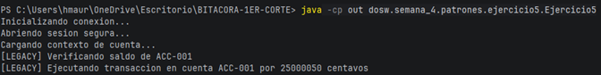

**Justificacion — por que esta combinacion es superior a resolverlo sin patrones:**
Adapter resuelve 'hablar el idioma del otro sistema'; Facade resuelve 'no me cuentes todos los detalles, dame lo simple'. Son complementarios: la Facade usa el Adapter internamente, cada uno resolviendo un problema distinto de la integracion.

---

### Ejercicio 06 — Motor de Recomendaciones
**Patrones combinados:** Strategy + Observer

Una plataforma tipo Netflix usa algoritmos de recomendacion por genero, historial y popularidad. Cuando el usuario cambia sus preferencias, la pagina principal, notificaciones y sugeridos deben actualizarse automaticamente.

**Rol de cada patron:**
**Strategy** (`GenreStrategy`, `HistoryStrategy`, `PopularityStrategy`) permite intercambiar el algoritmo de recomendacion en tiempo de ejecucion sin reiniciar el motor. **Observer** (`HomePageComponent`, `NotificationService`, `SuggestedListComponent`) notifica automaticamente a todos los componentes cuando cambian las preferencias del usuario.

**Como interactuan:**
El usuario cambia sus preferencias -> el `UserProfile` (Subject) notifica a sus Observers -> cada Observer reconsulta las recomendaciones usando el nuevo algoritmo Strategy configurado -> la UI se actualiza sin polling.

**Codigo implementado:**
```java
package dosw.semana_4.patrones.ejercicio6;

import java.util.ArrayList;
import java.util.List;

/**
 * Ejercicio 06 - Motor de Recomendaciones
 * Patrones: Strategy + Observer
 */
public class Ejercicio6 {

    static class Content {
        String titulo;
        Content(String titulo) { this.titulo = titulo; }
        public String toString() { return titulo; }
    }
    static class User {
        String nombre;
        RecommendationAlgorithm algoritmo;
        User(String nombre, RecommendationAlgorithm algoritmo) { this.nombre = nombre; this.algoritmo = algoritmo; }
    }

    interface RecommendationAlgorithm { List<Content> recommend(User user); }
    static class GenreStrategy implements RecommendationAlgorithm {
        public List<Content> recommend(User user) { return List.of(new Content("Accion 1"), new Content("Accion 2")); }
    }
    static class HistoryStrategy implements RecommendationAlgorithm {
        public List<Content> recommend(User user) { return List.of(new Content("Basado en tu historial")); }
    }
    static class PopularityStrategy implements RecommendationAlgorithm {
        public List<Content> recommend(User user) { return List.of(new Content("Tendencia global 1")); }
    }

    interface PreferenceObserver { void onPreferenceChanged(User user); }
    static class HomePageComponent implements PreferenceObserver {
        public void onPreferenceChanged(User user) {
            System.out.println("[HomePage] Recargando con: " + user.algoritmo.recommend(user));
        }
    }
    static class NotificationService implements PreferenceObserver {
        public void onPreferenceChanged(User user) {
            System.out.println("[Notificaciones] Nueva recomendacion para " + user.nombre);
        }
    }
    static class SuggestedListComponent implements PreferenceObserver {
        public void onPreferenceChanged(User user) {
            System.out.println("[Sugeridos] Lista actualizada: " + user.algoritmo.recommend(user));
        }
    }

    static class UserProfile {
        User user;
        List<PreferenceObserver> observers = new ArrayList<>();
        UserProfile(User user) { this.user = user; }
        void addObserver(PreferenceObserver o) { observers.add(o); }
        void changeAlgorithm(RecommendationAlgorithm algoritmo) {
            user.algoritmo = algoritmo;
            for (PreferenceObserver o : observers) o.onPreferenceChanged(user);
        }
    }

    public static void main(String[] args) {
        User julian = new User("Julian", new GenreStrategy());
        UserProfile profile = new UserProfile(julian);
        profile.addObserver(new HomePageComponent());
        profile.addObserver(new NotificationService());
        profile.addObserver(new SuggestedListComponent());

        profile.changeAlgorithm(new PopularityStrategy());
        profile.changeAlgorithm(new HistoryStrategy());
    }
}
```

**Captura de ejecucion:**

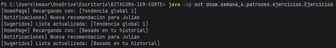

**Justificacion — por que esta combinacion es superior a resolverlo sin patrones:**
Strategy responde 'como recomendar'; Observer responde 'a quien avisar que cambio el como'. Son ortogonales: cambiar el algoritmo (Strategy) dispara el aviso (Observer) a los componentes que deben re-renderizarse.

---

### Ejercicio 07 — Flujo de Aprobacion de Documentos
**Patrones combinados:** Chain of Responsibility + State

Los documentos pasan por revision del autor y del lider (entre otras etapas). Ademas tienen estados propios: borrador, en revision, aprobado, rechazado. La transicion de estado depende del resultado de cada handler de la cadena.

**Rol de cada patron:**
**Chain of Responsibility** (`AutorHandler`, `LiderHandler`) encadena los validadores; cada handler decide si procesa el documento segun su estado actual o lo pasa al siguiente. **State** (`DraftState`, `InReviewState`, `ApprovedState`, `RejectedState`) maneja las transiciones de estado del documento, eliminando los switch/if de estado.

**Como interactuan:**
Un handler de la cadena procesa el documento -> segun su resultado invoca `document.approve()` o `document.reject()` -> el objeto State actual ejecuta la transicion correspondiente -> el documento nunca tiene un switch de estados explicito.

**Codigo implementado:**
```java
package dosw.semana_4.patrones.ejercicio7;

/**
 * Ejercicio 07 - Flujo de Aprobacion de Documentos
 * Patrones: Chain of Responsibility + State
 */
public class Ejercicio7 {

    static class Document {
        String nombre;
        DocumentState state;
        Document(String nombre) { this.nombre = nombre; this.state = new DraftState(); }
        void approve() { state.approve(this); }
        void reject() { state.reject(this); }
        void setState(DocumentState state) {
            this.state = state;
            System.out.println("Documento '" + nombre + "' ahora esta en estado: " + state.getClass().getSimpleName());
        }
    }

    interface DocumentState {
        void approve(Document doc);
        void reject(Document doc);
    }
    static class DraftState implements DocumentState {
        public void approve(Document doc) { doc.setState(new InReviewState()); }
        public void reject(Document doc) { System.out.println("No se puede rechazar un borrador"); }
    }
    static class InReviewState implements DocumentState {
        public void approve(Document doc) { doc.setState(new ApprovedState()); }
        public void reject(Document doc) { doc.setState(new RejectedState()); }
    }
    static class ApprovedState implements DocumentState {
        public void approve(Document doc) { System.out.println("Ya esta aprobado"); }
        public void reject(Document doc) { System.out.println("No se puede rechazar un documento aprobado"); }
    }
    static class RejectedState implements DocumentState {
        public void approve(Document doc) { System.out.println("No se puede aprobar un documento rechazado"); }
        public void reject(Document doc) { System.out.println("Ya esta rechazado"); }
    }

    static abstract class DocumentHandler {
        private DocumentHandler next;
        DocumentHandler setNext(DocumentHandler next) { this.next = next; return next; }
        void handle(Document doc) {
            if (canHandle(doc)) process(doc);
            else if (next != null) next.handle(doc);
            else System.out.println("Nadie mas puede procesar el documento");
        }
        abstract boolean canHandle(Document doc);
        abstract void process(Document doc);
    }
    static class AutorHandler extends DocumentHandler {
        boolean canHandle(Document doc) { return doc.state instanceof DraftState; }
        void process(Document doc) {
            System.out.println("Revision del autor OK");
            doc.approve();
        }
    }
    static class LiderHandler extends DocumentHandler {
        boolean canHandle(Document doc) { return doc.state instanceof InReviewState; }
        void process(Document doc) {
            System.out.println("Revision del lider OK");
            doc.approve();
        }
    }

    public static void main(String[] args) {
        Document doc = new Document("Contrato-001");
        DocumentHandler autor = new AutorHandler();
        DocumentHandler lider = new LiderHandler();
        autor.setNext(lider);

        System.out.println("--- Primera pasada por la cadena ---");
        autor.handle(doc);
        System.out.println("--- Segunda pasada por la cadena ---");
        autor.handle(doc);
    }
}
```

**Captura de ejecucion:**

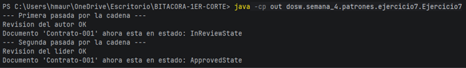

**Justificacion — por que esta combinacion es superior a resolverlo sin patrones:**
Sin State, cada metodo de `Document` tendria un switch(estado){...}; con State, cada estado encapsula su propio comportamiento y sabe a que estado puede transicionar. El documento no sabe en que estado esta -- su estado sabe que hacer.

---

### Ejercicio 08 — Sistema de Pedidos en Restaurante
**Patrones combinados:** Builder + Observer

El cliente construye un pedido eligiendo tamano, carne, toppings y acompanamientos. Despues de confirmado, el sistema debe notificar a cocina, facturacion y domicilio sin que el pedido los conozca directamente.

**Rol de cada patron:**
**Builder** (`PedidoBuilder`) construye el pedido personalizado paso a paso, evitando un constructor con todos los ingredientes como parametros; el `Pedido` resultante es inmutable una vez construido. **Observer** (`KitchenService`, `BillingService`, `DeliveryService`) notifica a los subsistemas cuando el pedido se confirma.

**Como interactuan:**
El cliente configura el pedido con el Builder -> llama `build()` que retorna un Pedido inmutable -> el sistema llama `pedido.confirm()` -> el Pedido notifica a todos sus Observers -> cada subsistema reacciona de forma independiente.

**Codigo implementado:**
```java
package dosw.semana_4.patrones.ejercicio8;

import java.util.ArrayList;
import java.util.List;

/**
 * Ejercicio 08 - Sistema de Pedidos en Restaurante
 * Patrones: Builder + Observer
 */
public class Ejercicio8 {

    enum Size { SMALL, MEDIUM, LARGE }
    enum Meat { SIMPLE_BEEF, DOUBLE_BEEF, CHICKEN }

    static class Pedido {
        final Size size;
        final Meat meat;
        final List<String> toppings;
        final List<String> sides;
        private final List<PedidoObserver> observers = new ArrayList<>();

        Pedido(Size size, Meat meat, List<String> toppings, List<String> sides) {
            this.size = size; this.meat = meat; this.toppings = toppings; this.sides = sides;
        }
        void addObserver(PedidoObserver o) { observers.add(o); }
        void confirm() {
            System.out.println("Pedido confirmado: " + size + " " + meat + " con " + toppings + " y " + sides);
            for (PedidoObserver o : observers) o.onPedidoConfirmado(this);
        }
    }

    static class PedidoBuilder {
        private Size size = Size.MEDIUM;
        private Meat meat = Meat.SIMPLE_BEEF;
        private final List<String> toppings = new ArrayList<>();
        private final List<String> sides = new ArrayList<>();
        PedidoBuilder setSize(Size s) { this.size = s; return this; }
        PedidoBuilder setMeat(Meat m) { this.meat = m; return this; }
        PedidoBuilder addTopping(String... t) { toppings.addAll(List.of(t)); return this; }
        PedidoBuilder addSide(String... s) { sides.addAll(List.of(s)); return this; }
        Pedido build() { return new Pedido(size, meat, List.copyOf(toppings), List.copyOf(sides)); }
    }

    interface PedidoObserver { void onPedidoConfirmado(Pedido pedido); }
    static class KitchenService implements PedidoObserver {
        public void onPedidoConfirmado(Pedido pedido) { System.out.println("[Cocina] Preparando pedido..."); }
    }
    static class BillingService implements PedidoObserver {
        public void onPedidoConfirmado(Pedido pedido) { System.out.println("[Facturacion] Generando cuenta..."); }
    }
    static class DeliveryService implements PedidoObserver {
        public void onPedidoConfirmado(Pedido pedido) { System.out.println("[Domicilio] Preparando ruta..."); }
    }

    public static void main(String[] args) {
        Pedido pedido = new PedidoBuilder()
                .setSize(Size.LARGE)
                .setMeat(Meat.DOUBLE_BEEF)
                .addTopping("queso", "lechuga")
                .addSide("papas", "gaseosa")
                .build();

        pedido.addObserver(new KitchenService());
        pedido.addObserver(new BillingService());
        pedido.addObserver(new DeliveryService());

        pedido.confirm();
    }
}
```

**Captura de ejecucion:**

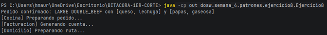

**Justificacion — por que esta combinacion es superior a resolverlo sin patrones:**
Builder garantiza que el pedido este completo y valido antes de existir; Observer garantiza que la confirmacion desencadene reacciones sin acoplamiento directo entre el Pedido y cada subsistema. Son momentos distintos del ciclo de vida del pedido.

---

### Ejercicio 09 — Sistema de Autenticacion Empresarial
**Patrones combinados:** Strategy + Chain of Responsibility

La empresa tiene varios metodos de autenticacion (contrasena, Google, biometria). Una vez autenticado, la solicitud pasa por validacion de credenciales, permisos, ubicacion y horario laboral en secuencia.

**Rol de cada patron:**
**Strategy** (`PasswordStrategy`, `GoogleStrategy`, `BiometricStrategy`) selecciona el mecanismo de autenticacion segun el tipo de usuario. **Chain of Responsibility** (`CredentialValidator` -> `PermissionValidator` -> `LocationValidator` -> `TimeValidator`) procesa las validaciones posteriores en secuencia, donde cada una puede detener el flujo.

**Como interactuan:**
El usuario intenta acceder -> el `AuthService` selecciona la Strategy correcta y autentica -> el resultado pasa por la cadena de validadores -> si todos aprueban, se concede acceso.

**Codigo implementado:**
```java
package dosw.semana_4.patrones.ejercicio9;

/**
 * Ejercicio 09 - Sistema de Autenticacion Empresarial
 * Patrones: Strategy + Chain of Responsibility
 */
public class Ejercicio9 {

    static class Credentials {
        String usuario;
        Credentials(String usuario) { this.usuario = usuario; }
    }
    static class AuthResult {
        boolean success;
        String usuario;
        AuthResult(boolean success, String usuario) { this.success = success; this.usuario = usuario; }
    }

    interface AuthStrategy { AuthResult authenticate(Credentials c); }
    static class PasswordStrategy implements AuthStrategy {
        public AuthResult authenticate(Credentials c) {
            System.out.println("Autenticando con usuario/contrasenia");
            return new AuthResult(true, c.usuario);
        }
    }
    static class GoogleStrategy implements AuthStrategy {
        public AuthResult authenticate(Credentials c) {
            System.out.println("Autenticando con Google");
            return new AuthResult(true, c.usuario);
        }
    }
    static class BiometricStrategy implements AuthStrategy {
        public AuthResult authenticate(Credentials c) {
            System.out.println("Autenticando con biometria");
            return new AuthResult(true, c.usuario);
        }
    }

    static class AccessDeniedException extends RuntimeException {
        AccessDeniedException(String msg) { super(msg); }
    }

    static abstract class Validator {
        private Validator next;
        Validator setNext(Validator next) { this.next = next; return next; }
        void validate(AuthResult result) {
            check(result);
            if (next != null) next.validate(result);
        }
        abstract void check(AuthResult result);
    }
    static class CredentialValidator extends Validator {
        void check(AuthResult result) {
            if (!result.success) throw new AccessDeniedException("Credenciales invalidas");
            System.out.println("Credenciales validas para " + result.usuario);
        }
    }
    static class PermissionValidator extends Validator {
        void check(AuthResult result) { System.out.println("Permisos verificados para " + result.usuario); }
    }
    static class LocationValidator extends Validator {
        void check(AuthResult result) { System.out.println("Ubicacion verificada para " + result.usuario); }
    }
    static class TimeValidator extends Validator {
        void check(AuthResult result) { System.out.println("Horario laboral verificado para " + result.usuario); }
    }

    static class AuthService {
        AuthResult login(AuthStrategy strategy, Credentials credentials, Validator chain) {
            AuthResult result = strategy.authenticate(credentials);
            chain.validate(result);
            System.out.println("Acceso concedido a " + result.usuario);
            return result;
        }
    }

    public static void main(String[] args) {
        Validator cred = new CredentialValidator();
        Validator perm = new PermissionValidator();
        Validator loc = new LocationValidator();
        Validator time = new TimeValidator();
        cred.setNext(perm).setNext(loc).setNext(time);

        AuthService service = new AuthService();
        service.login(new GoogleStrategy(), new Credentials("julian"), cred);
    }
}
```

**Captura de ejecucion:**

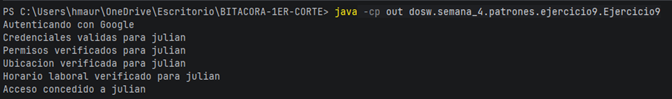

**Justificacion — por que esta combinacion es superior a resolverlo sin patrones:**
Strategy decide 'como autentico' (quien eres); Chain decide 'si tengo acceso' (que puedo hacer) una vez autenticado. Son fases distintas del proceso: autenticacion primero, autorizacion despues.

---

### Ejercicio 10 — Aplicacion de Edicion de Imagenes
**Patrones combinados:** Decorator + Command

La app permite aplicar filtros acumulativos (sepia, brillo, blanco y negro) sobre la misma imagen en cualquier orden. Cada accion debe poder deshacerse.

**Rol de cada patron:**
**Decorator** (`SepiaDecorator`, `BrightnessDecorator`, `GrayscaleDecorator`) aplica filtros de forma acumulativa envolviendo la imagen; se pueden apilar en cualquier orden sin modificar los filtros existentes. **Command** (`ApplyFilterCommand`) encapsula cada operacion del usuario como un objeto con `execute()` y `undo()`, guardando el estado anterior para poder revertir.

**Como interactuan:**
El usuario aplica un filtro -> se crea un `ApplyFilterCommand` que envuelve la imagen actual con el Decorator correspondiente -> al hacer undo, el Command restaura la imagen guardada antes de aplicar ese filtro.

**Codigo implementado:**
```java
package dosw.semana_4.patrones.ejercicio10;

/**
 * Ejercicio 10 - Aplicacion de Edicion de Imagenes
 * Patrones: Decorator + Command
 */
public class Ejercicio10 {

    interface Image { String render(); }
    static class BaseImage implements Image {
        public String render() { return "ImagenBase"; }
    }
    static abstract class ImageDecorator implements Image {
        protected final Image wrapped;
        ImageDecorator(Image wrapped) { this.wrapped = wrapped; }
    }
    static class GrayscaleDecorator extends ImageDecorator {
        GrayscaleDecorator(Image i) { super(i); }
        public String render() { return wrapped.render() + " + BlancoYNegro"; }
    }
    static class SepiaDecorator extends ImageDecorator {
        SepiaDecorator(Image i) { super(i); }
        public String render() { return wrapped.render() + " + Sepia"; }
    }
    static class BrightnessDecorator extends ImageDecorator {
        BrightnessDecorator(Image i) { super(i); }
        public String render() { return wrapped.render() + " + Brillo"; }
    }

    interface ImageCommand { void execute(); void undo(); }

    static class ImageEditor {
        Image image;
        ImageEditor(Image base) { this.image = base; }
    }

    static class ApplyFilterCommand implements ImageCommand {
        private final ImageEditor editor;
        private final java.util.function.Function<Image, Image> filter;
        private Image previous;
        ApplyFilterCommand(ImageEditor editor, java.util.function.Function<Image, Image> filter) {
            this.editor = editor; this.filter = filter;
        }
        public void execute() {
            previous = editor.image;
            editor.image = filter.apply(editor.image);
            System.out.println("Aplicado -> " + editor.image.render());
        }
        public void undo() {
            editor.image = previous;
            System.out.println("Deshecho -> " + editor.image.render());
        }
    }

    public static void main(String[] args) {
        ImageEditor editor = new ImageEditor(new BaseImage());

        ImageCommand sepia = new ApplyFilterCommand(editor, SepiaDecorator::new);
        sepia.execute();

        ImageCommand brillo = new ApplyFilterCommand(editor, BrightnessDecorator::new);
        brillo.execute();

        ImageCommand grayscale = new ApplyFilterCommand(editor, GrayscaleDecorator::new);
        grayscale.execute();

        System.out.println("--- Deshaciendo el ultimo filtro aplicado (grayscale) ---");
        grayscale.undo();
    }
}
```

**Captura de ejecucion:**

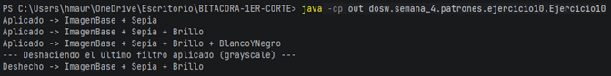

**Justificacion — por que esta combinacion es superior a resolverlo sin patrones:**
Decorator resuelve la composicion de filtros sin explosion de subclases (5 filtros combinables serian 32 subclases sin Decorator, y solo 5 wrappers con el); Command resuelve el historial de acciones reversibles. Son el complemento perfecto para edicion no destructiva.

---

## Retos Especiales (si aplica)
- [ ] Reto Legendario — Method References
- [ ] Reto Shiny — Buenas practicas de commits
- [ ] Reto Mewtwo — Ejercicio propuesto

---

## Estrategia de ramas (Git Flow)
- Ramas principales: `main` y `develop`.
- Por cada semana: `feature/semana-n-dosw`.
- Por cada ejercicio: `feature/semana-n-dosw-ejercicio-n`, mergeada hacia la rama de la semana y luego eliminada.
- Al completar la semana, `feature/semana-n-dosw` se fusiona a `develop` mediante Pull Request (esta rama semanal no se elimina, queda como evidencia).
- Al cierre de cada ciclo, se sincroniza `develop` hacia `main`.
